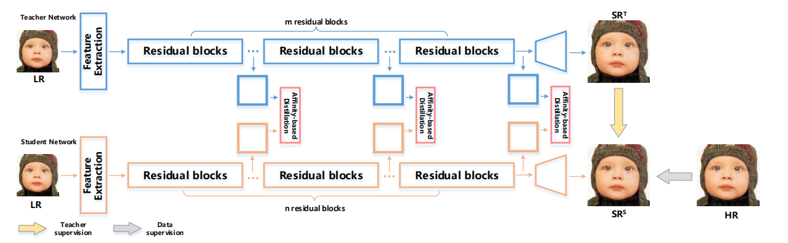
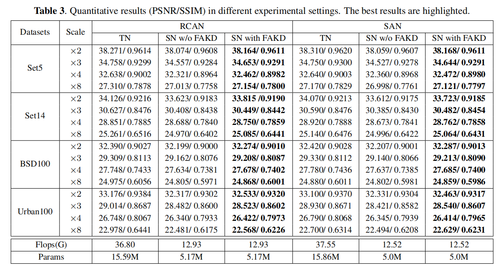

# Knowledge Distillation for Super-Resolution
### Introduction

This repository is the official implementation of the paper **"FAKD: Feature-Affinity Based Knowledge Distillation for Efficient Image Super-Resolution"** from **ICIP 2020**. In this work, we propose a novel and efficient SR model, name Feature Affinity-based Knowledge Distillation (FAKD), by transferring the structural  knowledge of a heavy teacher model to a lightweight student model. To transfer the structural knowledge effectively, FAKD aims to distill the second-order statistical information from feature maps and trains a lightweight student network with low computational and memory cost. Experimental results demonstrate the efficacy of our method and superiority over other knowledge distillation based methods in terms of both quantitative and visual metrics.



### Main Results

Here is the quantitative results (PSNR and SSIM) of RCAN and SAN with and w/o FAKD. Teacher Network (TN) and Student Network (SN) are under the same network architecture, but with different network depth or width.



**Note:**

- RCAN is from the paper [Image Super-Resolution Using Very Deep Residual Channel Attention Networks](www.arxiv.org/abs/1807.02758).
- SAN is from the paper [Second-order Attention Network for Single Image Super-resolution](http://openaccess.thecvf.com/content_CVPR_2019/html/Dai_Second-Order_Attention_Network_for_Single_Image_Super-Resolution_CVPR_2019_paper.html).

### Quick Start

#### Dependencies

- python 3.6.9
- pytorch 1.1.0
- skimage 0.15.0
- numpy 1.16.4
- imageio 2.6.1
- matplotlib
- tqdm

#### Data Preparation

We use [DIV2K](http://people.ee.ethz.ch/~timofter/publications/Agustsson-CVPRW-2017.pdf) dataset as training set which you can download from [here](cv.snu.ac.kr/research/EDSR/DIV2K.tar) and use four benchmark dataset (Set5, Set14, B100, Urban100) as testing set which you can down from [here](cv.snu.ac.kr/research/EDSR/benchmark.tar).

Unpack the tar file and arrange the data directory as follows. Then change the `dir_data` argument in the `code/option.py` to `{DATA_ROOT}`.

```
${DATA_ROOT}
|-- DIV2K
|-- benchmark
    |-- Set5
    |-- Set14
    |-- B100
    |-- Urban100
```

#### Training

Download the teacher model from [here](https://drive.google.com/drive/folders/1qxE2XwBOI2kO0Obi7IC1mYzkfgTyeY61?usp=sharing) and place it into folder `teacher_checkpoint`. 

```sh
python train.py --ckp_dir overall_distilation/rcan/SA_x4/ --scale 4 --teacher [RCAN] --model RCAN --alpha 0.5 --feature_loss_used 1 --feature_distilation_type 10*SA --features [1,2,3] --epochs 200 --save_results --chop --patch_size 192
```

More training scripts can be seen in `code/scripts`.

#### Testing

Download the distilled model of RCANx4 from [here](https://drive.google.com/drive/folders/13df3iuOcoKZXr-3tIqWt8K_4hyVWfK5d?usp=sharing) and test the result. 

```sh
python test.py --ckp_path <checkpoint path> --TS S --scale 4 --model RCAN --n_resgroups 10 --n_resblocks 6
```

### Acknowledgement

The code is built on [EDSR (Pytorch)](https://github.com/thstkdgus35/EDSR-PyTorch/tree/legacy/1.1.0). We thank the authors for sharing the codes.